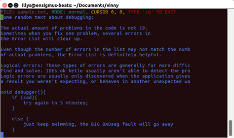

# Vinny: a Command-Line Text Editor in C

*May 8, 2019*

*Ilya Besancon and Duncan Hall*

## Description

This is Vinny, a command-line text editor in C that clones some of vim's basic features. Vinny currently has limited functionality, but the core structure of a text editor was the primary goal for the project. Vinny allows switching of modes, navigation of a cursor, an insertion and deletion of characters, and a command mode for saving and quitting, all with a basic view displaying lines, line numbers, mode, and cursor.

## Code Structure

We started by spending some time figuring out the sort of code architecture that would best support the objective, and have settled on a Model-View-Controller pattern. This way we have isolated code for getting input from the user and showing the user visual feedback.

To begin Vinny sets up the Model component represented by a `State` struct by reading the entirety of a file into memory. This is clearly not the best approach for a text editor which may be used on large files, but for our purposes we did not want to get into the weeds of vim's use of temporary .swp files. From there Vinny enters it's main loop in which we `print_state()` and `update_state()`, passing this shared `State` to both routines.

``` c
while(1) {
    // get window dimensions
    if(ioctl(STDOUT_FILENO, TIOCGWINSZ, &w)) {
        printf("Unable to access line or column counts\n");
        exit(EXIT_FAILURE);
    }

    n_env_lines = w.ws_row;
    n_env_cols = w.ws_col;
    state->window_width = n_env_cols;
    state->window_height = n_env_lines;

    // print(state, width, height)
    print_state(state);

    // get input silently
    system ("/bin/stty raw");
    input = getchar();
    system ("/bin/stty cooked");

    // update(state)
    update_state(state, input);
}

```

The `update_state()` function along with the getting of window dimensions and character input makes up the Controller part of our code, handling input characters using dedicated functions depending on Vinny's current mode. 

``` c
void update_state(State *state, char input)
{
    if (state->mode == normal) {
        normal_mode_handler(state, input);
    }
    else if (state->mode == insert) {
        insert_mode_handler(state, input);
    }
    else if (state->mode == command) {
        command_mode_handler(state, input);
    }
}
```

Each of these modal input handlers use case statements to properly update the model, including transitioning between modes.

In the view section of code, `print_state()` is responsible for translating the state to an array of null-terminated strings formatted with line numbers, header, and cursor and printing it. Each line is built by concatenating onto a `new_line` buffer first a fixed-width gutter with a padded line number, then the corresponding `raw_line` from the state (after truncation if applicable). Special cases are made if there are not enough lines in a file to fill the terminal height as handled in the first conditional below, and if the current line is the cursor line, we insert ANSI coloring escape sequences to color one character's worth of background depending on the mode.

``` c
// empty line for concatination
char new_line[state->window_width+20];
new_line[0] = '\0';

// populate line if past end of file
if (i >= state->n_lines){
    formatted_line_ptrs[i - state->top_line] = " ~ \n";
    continue;
}

// get raw_line
raw_line = (state->lines)[i];

// truncate raw_line;
if(strlen(raw_line) > state->window_width + 1 - gutter_size){ // +1 for '\n'
    raw_line[state->window_width - gutter_size] = '\n';
    raw_line[state->window_width - gutter_size + 1] = '\0';
}

// concatenate the data line
str_insert(new_line, raw_line, 0);

// insert cursor formatting
if (i == state->cursor_row) {
    str_insert(new_line, NORM, state->cursor_col + 1);
    if (state->mode == normal) str_insert(new_line, BACK1, state->cursor_col);
    else if (state->mode == insert) str_insert(new_line, BACK2, state->cursor_col);
    else if (state->mode == command) str_insert(new_line, BACK3, state->cursor_col);
}

formatted_line_ptrs[i-state->top_line] = strdup(new_line);
```
After this, printing is done using a simple for loop, line by line through `char *formatted_line_ptrs`;


## Challenges

After integrating out different functions, we ran into several issues regarding memory management bugs. We recognize that this is the cornerstone of programming in C challenges, and even after numerous hours of debugging we were left stumped. There are a couple of different segmentation faults that we run into when we try to integrate full functionality of Vinny. We used `valgrind` to check for memory leaks, and saw that we were losing about 120 bytes in 1 block. We are also running into inconsistent behavior across our two operating systems: Linux (on Windows machine) and Mac OS. We spent countless hours parsing through our code and fixed multiple errors, but were not able to figure out the true culprit behind our issues.


## Outcome

Although we faced the aforementioned challenges, we were able to get a working version of Vinny! Our program reads lines from a file, copies them, formats them with a header and appropriate truncation (no line numbers) and prints the new array to the command window. We have three functioning modes: normal(esc), insert('i') and command mode(:). Normal mode allows for navigation around the window, insert mode allows for in-line character insertion, and command mode allows for saving of the modified file and quiting of the program. A green cursor provides visual feedback to its position, and changes to yellow in insert mode. Our navigation keys are h-left, j-down, k-up, l-right. A header at the top of the window indicates which file is open, what mode the user is in, the position of the cursor, and how to exit the program (:q).




## Reflection

We wanted to write a program in C to explore our learnings of the semester through a command-line text editor - and we (somewhat) made one! This was an excellent project to put the concepts we learned about this year into practice. That being said, the requisites of successful memory management were not fully met, though we did a good job working with file pointers, command line arguments and with our Model View Architecture.

In order to avoid such a whack-a-mole type development pattern in future projects, we discussed the merits of using tests and sticking to a disciplined git-inspired workflow for parallel development rather than continuing using teletype for atom, a plugin which allows for concurrent editing of a file by two or more developers. This was not optimal as one of us would necessarily not have access to the code locally for running, and each would have to comment out the functionality they were currently writing whenever the other wanted to try to compile and run.

This project was a great opportunity to develop a habit of using Git, developing in parallel, practicing integration, and general time management. Although we faced many headaches in the process, we are happy with where we ended up. We hope to continue working on this project and plan to rework it into a fully functional Vinny 2.0!

## Helpful Links

- [Github](https://github.com/DuncanDHall/vinny.git)
- [Trello](https://trello.com/b/1oTw5qhM/vinny)